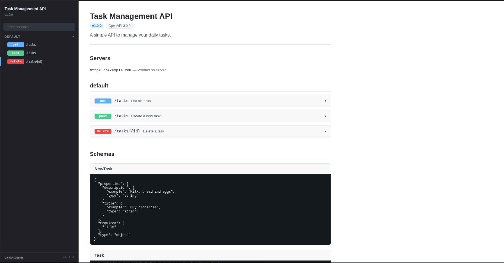

# oas2html

Tool to convert OpenAPI specifications (Swagger 2.0/OpenAPI 3.x) to self-contained HTML documentation.

Supports JSON and YAML input. Output is a single HTML file with embedded CSS and JavaScript and no external dependencies.



## Usage

```bash
oas2html <input> [--output <file>] [--title <override>]
```

| Argument | Description |
|---|---|
| `<input>` | Path to the OpenAPI spec (`.json`, `.yaml`, or `.yml`) |
| `-o, --output <file>` | Write HTML to a file instead of stdout |
| `-t, --title <text>` | Override the API title in the rendered output |

### Examples

```bash
# Write to stdout
oas2html api.yaml

# Write to a file
oas2html api.yaml -o docs/api.html

# Override title
oas2html openapi.json -o api.html -t "My API v2"
```

## Build

### With Nix (recommended)

```bash
# Build the binary
nix build

# Run directly
nix run . -- api.yaml -o api.html

# Enter dev shell with rust-analyzer and cargo-watch
nix develop
```

### With Cargo

```bash
cargo build --release
./target/release/oas2html api.yaml -o api.html
```

## Supported formats

| Feature | Swagger 2.0 | OpenAPI 3.x |
|---|---|---|
| Info (title, version, description) | x | x |
| Servers / host | x | x |
| Tags | x | x |
| Paths and operations | x | x |
| Parameters | x | x |
| Request body | x | x |
| Responses | x | x |
| Schemas / definitions | x | x |
| Security schemes | x | x |
| Contact / license | x | x |

Swagger 2.0 parsing uses the [`openapi`](https://crates.io/crates/openapi) crate for typed deserialization. OpenAPI 3.x specs are parsed via `serde_json`/`serde_yaml`.

## HTML output features

- Sidebar with endpoint list, grouped by tag
- Live filter / search
- Collapsible operation panels
- Method badges (color-coded GET/POST/PUT/PATCH/DELETE ...)
- Parameter tables with location badges (path/query/header/body)
- Request body and response schemas
- Security scheme descriptions
- Scroll-spy active-link highlighting
- Single self-contained file. No CDN or network required
